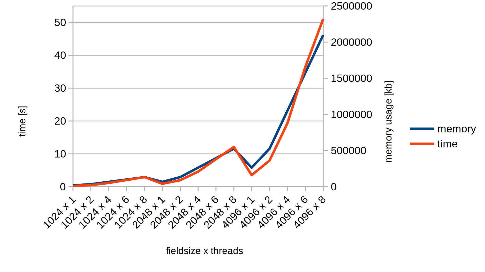

## RAM Nutzung
Genutzte Variablen:
```
int width
int height
int num_threads
int TimeSteps
long time_step
double *temp = currentfield
double *currentfield = calloc(width * height, sizeof(double))
double *newfield = calloc(width * height, sizeof(double))
```

in omp parallel:
```
int i
int x_start
int x_end
int y_start
int y_end
int y
int x
int n
int index

int y1
int x1
```

Variablen Größen (bytes):
```
int_size = 4
double_size = 8
float_size = 4
long_size = 8
```

Max RAM Nutzung:
```
usage = (4 * int_size) + (1 * long_size) + (2 * width * height * double_size) 
+ num_threads * (int_size * 9)
```

## VTI Festplatten-Speicher Nutzung für einen Zeitschritt

```
            Header/Footer, Verweise
main_file = 334 * 1 + 58 * #fields
          = 334 * 1 + 58 * (Px * Py)

            Header/Footer, Data
sub_files = 397 * #files + float_size * #pixel
          = 397 * (Px * Py) + 4 * (Px * Py * nx * ny)

sum_disk_usage = 334 * 1 + 58 * (Px * Py) + 397 * (Px * Py) + 4 * (nx * ny * Px * Py)
```
-> Durch Header und Verweise wird deutlich mehr Speicherplatz zum persistieren benötigt als RAM bei der Ausführung

## Laufzeitanalyse
Die Laufzeit ist proportional zum genutzten Speicher.

